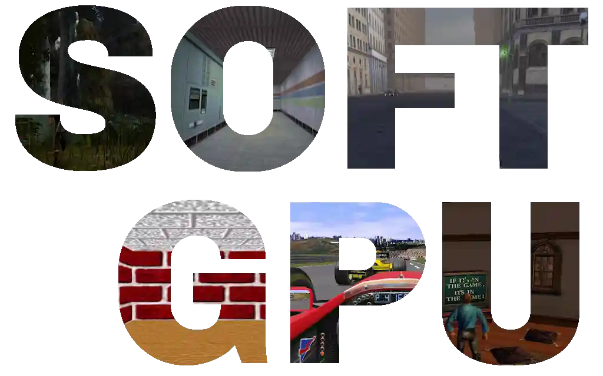
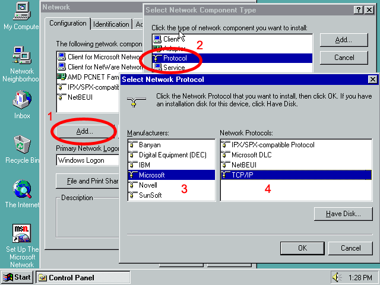
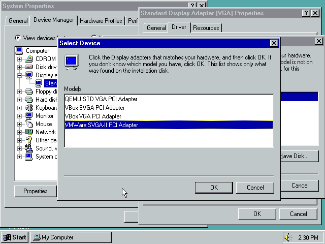
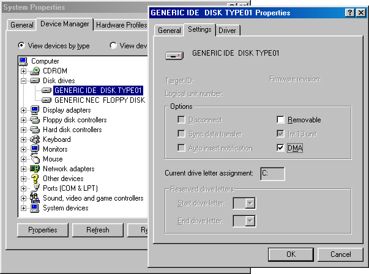
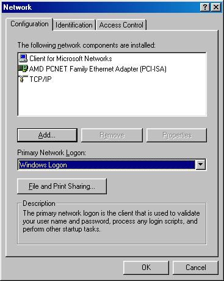

# SoftGPU: SW and HW accelerated driver for Windows 9x Virtual Machines



This is ready-to-use compilation of my 6 projects:
- VMDisp9x: https://github.com/JHRobotics/vmdisp9x
- Mesa3D for 9x: https://github.com/JHRobotics/mesa9x
- WineD3D for 9x: https://github.com/JHRobotics/wine9x
- OpenGlide for 9x: https://github.com/JHRobotics/openglide9x
- VMHAL9x: https://github.com/JHRobotics/vmhal9x
- ICD enabled fork of qemu-3dfx: https://github.com/JHRobotics/qemu-3dfx

## Requirements
1) Machine with one of these VGA adapter support:
   - A) Virtual machine supporting Bochs VBE (Bochs, VirtualBox, Qemu)
   - B) Virtual machine supporting VMware SVGA-II (VMware, VirtualBox, Qemu)
   - C) Real or virtual machine with video adapter supporting VESA VBE 2.0 at minimum
2) Windows 95/98/Me as VM guest system (or main system at bare metal):
   - A) Windows 98/Me - required is last version of DirectX 9 (included in package)
   - B) Windows 95
      - Last version of DirectX 8 (included in package)
      - Visual C runtime (version 6 included in package)
      - OpenGL 95 for versions without `opengl32.dll` (included in package)
      - dotcom for Windows 95 (required by DX, included)
      - Winsock 2 (LLVM depends on `ws2_32.dll`, included)

## Feature support

| Hypervisor         | Version    | Adapter  | VGA driver  | 32 bpp | 16 bpp |  8 bpp |  HW 3D  | Sound drivers     |
| :----------------- | :--------: | :-----:  | :---------: | :----: | :----: | :----: | :-----: | :---------------- |
| Oracle VirtualBox  | 6.1, 7.0   | VboxVGA  |     ✔      |   ✔   |   ✔   |   ✔   |   ❌    | SB16, AC97        |
| Oracle VirtualBox  | 6.1, 7.0   | VboxSVGA |     ✔      |   ✔   |   ✔   |   ✔   |   ✔    | SB16, AC97        |
| Oracle VirtualBox  | 6.1, 7.0   |  VMSVGA  |     ✔      |   ✔   |   ✔   |   ✔   |   ✔    | SB16, AC97        |
| Oracle VirtualBox  | 6.0        | VboxVGA  |     ✔      |   ✔   |   ✔   |   ✔   |   ❌    | SB16, AC97        |
| Oracle VirtualBox  | 6.0        | VboxSVGA |    ❌      |   -   |   -   |   -   |   ❌   | n/a        |
| Oracle VirtualBox  | 6.0        |  VMSVGA  |    ❌      |   -   |   -   |   -   |   ❌   | n/a        |
| Oracle VirtualBox  | 5.2        |    -     |     ✔      |   ✔   |   ✔   |   ✔   |   ❌    | SB16, AC97        |
| VMware Workstation | 16, 17     |    -     |     ✔      |   ✔   |   ✔   |   ⚠   |   ✔    | speaker, SBPCI128          |
| QEMU               | 7.x, 8.0   |   std    |     ✔      |   ✔   |   ✔   |   ✔   |   ❌    | speaker, adlib, GUS, SB16, WSS, AC97, SBPCI128 |
| QEMU               | 7.x, 8.0   |  vmware  |     ✔      |   ✔   |   ❌   |   ❌   |   ❌    | speaker, adlib, GUS, SB16, WSS, AC97, SBPCI128 |
| QEMU               | 7.x, 8.0   |   std + qemu-3dfx    |     ✔      |   ✔   |   ✔   |   ✔   |   ✔    | speaker, adlib, GUS, SB16, WSS, AC97, SBPCI128 |
| _Real Hardware_  | - | VESA 2.0/3.0 | ✔ | ✔ | ✔| ✔ | ❌ | _depends on configuration_ |

SoftGPU can use 4 render drivers:
- *softpipe*: software Mesa3D reference renderer
- *llvmlipe*: software LLVM accelerated 3D renderer
- *SVGA3D*: HW renderer for virtual GPU adapter VMWare SVGA-II (sometimes called VMSVGA, VboxSVGA or SVGA-III)
- *qemu-3dfx*: [3D passthrough for QEMU by KJ Liew](https://github.com/kjliew/qemu-3dfx), allow bypass OpenGL and GLIDE primitives to hypervisor's GPU. QEMU and fullscreen only.

Not all renderers supporting all application/games, performance expectation is in 1024x768 32bit:


| Renderer            | Guest Requirements   | DX9  | DX9 shaders | DX8  | DX8 shaders | DX6-7 | OpenGL | OpenGL version | multiple contexts | window mode | Glide | Glide DOS | Expected FPS |
| :------------------ | :------------: | :--: | :---------: | :--: | :---------: | :---: | :----: | :------------: | :---------------: | :---------: | :---: | :-------: | :----------: |
| softpipe            |      -         |  ✔  |      ✔     |  ✔  |      ✔     |  ✔   |   ✔   |     3.3        |  ✔               |  ✔         |  ✔   |    ❌     |    1-3       |
| llvmlipe (128 bits) |     SSE        |  ✔  |      ✔     |  ✔  |      ✔     |  ✔   |   ✔   |     4.5        |  ✔               |  ✔         |  ✔   |    ❌     |    10-15     |
| llvmlipe (256 bits) |   SSE, AVX     |  ✔  |      ✔     |  ✔  |      ✔     |  ✔   |   ✔   |     4.5        |  ✔               |  ✔         |  ✔   |    ❌     |    12-20     |
| SVGA3D              | SVGA-II (gen9) |  ✔  |      ❌     |  ✔  |      ❌     |  ✔   |   ✔   |     2.1        |  ⚠               |  ✔         |  ✔   |    ❌     |    30-100     |
| SVGA3D              | SVGA-II (gen10)|  ✔  |      ✔     |  ✔  |      ✔     |  ✔   |   ✔   |     3.3-4.3        |  ✔               |  ✔         |  ✔   |    ❌     |    30-80     |
| qemu-3dfx           | [qemu-3dfx](https://github.com/kjliew/qemu-3dfx) |  ✔  |      ✔     |  ✔               |  ✔         |   ✔  |      ✔     |     native        |  ❌   |   ❌   |  ✔ *   |    ✔ *     |    native/2 *  |

Note: expected FPS are for host with i7-4770 + GTX1650.

(*) Note for qemu-3dfx: performance depends on CPU emulation - you can reach about 1/2 of native GPU performance when using KVM acceleration on x86-64 host, about 1/5 when using Hyper-V, and about from 1/100 when is using accelerated emulation and about 1/1000 when using full emulation. DOS Glide and *native* Glide wrapper isn't part of SoftGPU. You have to compile it from source or you can [donate qemu-3dfx author](https://github.com/kjliew/qemu-3dfx#donation).


Hypervisor translation to real HW GPU:


| Renderer        | Host technology | Hypervisor support |
| :-------        | :-------------: | :----------------: |
| softpipe        |   framebuffer   | all                |
| llvmlipe        |   framebuffer   | all                |
| SVGA3D (gen 9)  | DX9/OpenGL 2.1  | VirtualBox 6+7, VMware Workstation |
| SVGA3D (gen 10) | DX11/Vulkan     | VirtualBox 7, VMware Workstation   |
| qemu-3dfx       | native OpenGL   | QEMU with qemu-3dfx patch|


## Download
ISO image or ZIP package can be downloaded on release page: https://github.com/JHRobotics/softgpu/releases/

## Hardware, firmware and OS setup

**None needed.**

Note: sometimes I speak here about BIOS, vGPU or registry, but in every case I speak about software **in virtual machine (VM)[^1]**. Special topic is vGPU: in this context I speak about paravirtual interface allow pass graphical primitives to host OS, but graphical manufacture using "vGPU" word to technology that allows split HW to multiple virtual instance and this technology is uncommon on most end-user hardware[^2].  

[^1]: Yes, VM has also own BIOS and VGA BIOS independent on your real HW BIOS.
[^2]: Some manufactures using same silicon in server and end-user hardware and only firmware is different, so by firmware modification you can allow split GPU to multiple instance on much cheaper cards. But SoftGPU cannot utilize anything from it! Please not modify your real HW firmware unless you pretty sure, that you really know, what you doing!

## Hypervisor specific setup

Here are some brief steps for individual virtualization software:
- [VirtualBox](vbox.md)
- [VMware Workstation/Player](vmware.md)
- [QEMU](qemu.md)

## Installation
General instruction for most machines:

0) Setup the Virtual Machine (VM)
1) Copy installation files on formatted HDD and apply **patcher9x** [Optional but recommended]
2) Install the Windows 95/98/Me [Windows 98 SE is recommended]
3) [optional] install **PATCHMEM by rloew** and increase VM memory (1024 MB is usually enough)
4) [optional] install audio drivers ([the most common drivers are below](#extra-drivers))[^3]
5) Run setup with `softgpu.exe`
6) Select *Hypervisor preset* to match your VM software
7) Press *Install!*
8) [optional] Install additional drivers, for example USB (if you added USB controller)
9) Have fun!

[^3]: Do this before install/update DirectX redistributable, because audio drivers usually overwrite DX files with outdated versions.

### Windows 95 installation

Windows 95 haven't [Setup API](https://learn.microsoft.com/en-us/windows/win32/api/setupapi/), or if has, it isn't fully operable. This is reason why SoftGPU cannot install driver automatically.

Before installation you have to enable TCP/IP because Winsock 2 depends on that and LLVM in Mesa depends on Winsock. You can do it on *Control panel*, *Network*, add *Protocol* and choose *Microsoft* and *TCP/IP*.



After it you can run SoftGPU, when press **Start!**, program will install all dependencies and configure and copy files but not install driver itself.

After SoftGPU installer is done. Open Device Manager (right click on *My Computer*, *Device Manager*). Find VGA adapter and click on *Properties...*, tab *Driver*, *Change driver...*, *Have disk...*, navigate to SoftGPU installation folder and click on *OK*.

Now you have to choose correct driver:



- QEMU STD VGA PCI Adapter = for QEMU with **std vga** adapter
- VBox SVGA PCI Adapter = for VirtualBox when selected `VBoxSVGA` as Graphics Controller.
- VBox VGA PCI Adapter = for VirtualBox when selected `VBoxVGA` as Graphics Controller or VirtualBox 5.x
- VMWare SVGA-II PCI Adapter = for VirtualBox when selected `VMSVGA` as Graphics Controller or VMware Workstation.

Press *OK*, *OK* and after reboot, VM should start with the new driver.


## Update
If you have an older version of SoftGPU installed, you can update without any problem: insert the CD with the latest version into the VM and click install. The installer will take care of all the necessary modifications, only to increase compatibility it is necessary to do some steps manually:

**Update VirtualBox to 7.0.16**

VirtualBox 7.0.16 correct some SVGA flags ([my bug report](https://www.virtualbox.org/ticket/22011)). But this need for Mesa9x/SoftGPU to correct some behaviour. When you update from VirtualBox lower version, please run `extra/tune/vbox-optimize-7.0.16.reg` on SoftGPU CD/in SoftGPU ZIP archive. If you don't do do this, you probably will see black screen on most 3D application/games.

**Update to version v0.5.2024.27**

SVGA3D (especially vGPU10) is very memory consuming. Please consider to apply additional patches and set RAM to 1024 MB. Driver itself can cache memory allocation and it is faster when you have 1 GB RAM and more.

**Update to version v0.5.2024.24**
- *VirtualBox 7.0.x*: it is possible to turn on vGPU10:
```
VBoxManage setextradata "My Windows 98" "VBoxInternal/Devices/vga/0/Config/VMSVGA10" "1"
``` 


## SoftGPU in action
- [3DMark03](https://youtu.be/0hm82MJL8h8) in version 0.5.2024.29
- [3DMark99](https://youtu.be/_CpQL7X6io0) in version 0.5.2024.29 + llvmpipe (software only)
- [3DMark99](https://youtu.be/2ykQKe-RjSs) in version 0.5.2024.29 + vGPU9
- [3DMark99](https://youtu.be/MUpt_wdXOAY) in version 0.5.2024.29 + vGPU10


For comparison, [video from real end-of-era PC is here](https://youtu.be/JqHw-Oh3TfY).

### Virtual GPU implementation

Here are compare between vGPU9 (VirtualBox 6.1 + 7, VMWare) versus vGPU10 (VirtualBox 7):

- [3DMark99](https://youtu.be/7JHALgeWoi8)
- [3DMark2000](https://youtu.be/j4DXZw_-xXE)
- [3DMark2001](https://youtu.be/pZtSJTIaIuw)

If we're speaking about 3DMark99, there is also [test width TNT PCI 16MB](https://youtu.be/J8nCwO2W7OM), *(C) 1999 STB SYSTEM, INC.* But on this 'GPU' isn't Quake 3 playable neither in 640x480, so keep in mind that test performance and gaming performance can vary quite a bit.

### Performance between SoftGPU version

Here are some videos from older versions of SoftGPU for performance comparison:

- [3DMark03](https://youtu.be/eHmzTE07VOc) in version 0.4.2023.19
- [3DMark03](https://youtu.be/XB7GYypyA18) in version 0.4.2023.18
- [3DMark2001](https://youtu.be/DyrnMKvaaj8) in version 0.4.2023.18
- [3DMark2000](https://youtu.be/8OwfFozcICo) in version 0.4.2023.18
- [3DMark99](https://youtu.be/jVp0jleQX_8) in version 0.4.2023.18


## Bugs
Currently there are known these limitations:

### Vertex Shaders
**Update for 0.5.x versions**: Vertex Shaders works on vGPUv10 (VirtualBox 7) and for qemu-3dfx. For vGPU9 (VMware, VirtualBox 6.1) are DirectX shaders disabled, so most of applications can use shader alternative (most of DX8 games lots of DX9).

### Windows 95 support
Windows 95 support is limited - SoftGPU works, but there lots of extra bugs will appear and if you haven't any special reasons for using Windows 95 use recommended Windows 98 Second edition instead.

### Other bugs
There are many bugs in individual components, please post them to individual repositories based on bugged application (DirectX, Glide, OpenGL).

But still, please be patient. SoftGPU compatibility target is about a decade of intensive HW and SW development (from DOS direct VGA/VESA access, SW rendering through GDI, DirectDraw, OpenGL, Glide, DirectX, OpenGL again). After all, there will still applications that cannot be run anyway because there are written for very individual SW/HW combinations.

## General tips
There are some tips without direct relation to SoftGPU but they can improve the user experience with MS Windows 9x OS.

### Fresh install
Prefer new installation over copy older installations done on different (even virtual) HW.

### Copy Installation to HDD before run setup
If you installed Windows 9x from CD, on near every system change your will be asked to insert Install CD. You can avoid it if you prepare HDD manually, copy installation from CD and run `setup.exe` from `C:` drive.

All utilities you need are on [patcher9x](https://github.com/JHRobotics/patcher9x) boot floppy. The short procedure follows:

- insert *patcher9x* floppy to floppy driver and Windows Installation CD to CD driver. Boot from floppy drive
- run `fdisk` and create primary dos partition (it wizard type program, just keep pressing `1`, `Y` and finally `ESC`).
- reboot after `fdisk` finish
- format HDD, copy files, install necessary patches and run the setup using following commands:
```
format C:
xcopy /v D:\win98\ C:\install\win98\
patch9x C:\install\win98 -auto
C:
cd install\win98
setup /ie /nm
```
Explanation: The `/v` switch with `xcopy` means *verify*. The `/ie` switch with `setup` means *skip recovery floppy creation* and `/nm` means *no machine check* - this is necessary because in Patcher9x boot floppy is using FreeDOS and MS setup program cannot determine RAM size without MS memory manager.

Now *setup* automatically runs `scandisk` and after complete it you can continue with installer GUI. You can also remove floppy and CD from drive at this point.

### Turn on DMA
Windows by default using interrupts to access HDD and CD drive. This is especially slow in the HW accelerated virtual machines because every interrupt will stop executing visualisation engine and hand over access to hypervisor to solve it and after that it'll be need to restart visualisation engine again. Time consumed by interrupts depends on visualization technology for example in QEMU + kvm is HDD access very slow equally VirtualBox + Hyper-V and combination QEMU + Hyper-V is downright painful. Fortunately there is DMA transfer of whole memory block instead of individual bytes. Unfortunately you have to enable it manually.

You can turn it on in Device Manager on HDD properties enable `DMA` checkbox. Do it the same for CD driver and reboot VM for applying changes.



### Change logon to Windows Logon
After install network card you are asked every time to enter the credentials - but this is not credentials to the computer but to the network (you can also skip this by press `ESC`). If you don't plan to install NT server as other VM and runs ancient network sharing, this is only annoying thing. You can turn it off in *Control panel* -> *Network* and change *Primary network logon* to **Windows Logon**.



## Extra drivers
These are links to some extra drivers for VM:
- [AC97 (version 3.62)](https://files.emulace.cz/ac97_362.zip) - for QEMU and VirtualBox
- [SB PCI 128](https://files.emulace.cz/sbpci_98se.exe) - for VMware Workstation
- [VMware mouse driver](https://files.emulace.cz/vmmouse.zip) ([floppy version](https://files.emulace.cz/vmmouse.ima))

If you wish download these drivers from Windows 9x directly, you can use these links (simply replace https -> http):
```
http://files.emulace.cz/ac97_362.zip
http://files.emulace.cz/sbpci_98se.exe
http://files.emulace.cz/vmmouse.zip
```

If you need tool for decompressing ZIP and other archives, there is 7-Zip in version with Windows 98 compatible:
```
http://files.emulace.cz/7z920.exe
```


## Runtime configuration

There a few registry keys to configure SoftGPU and its component, more on [softgpu.md](softgpu.md) or *softgpu.html* on SoftGPU CD.


## Compilation from source (outdated)
1) You need MINGW and *GNU make* to build *softgpu.exe*
2) You need all development tool to compile all other component (see README.md in individual repositories)
3) Compile softgpu.exe by type `make`
4) Compile VMDisp9x and copy files `boxvmini.drv`, `vmwsmini.drv`, `qemumini.drv`, `vmwsmini.vxd`, `vmdisp9x.inf` and place them to `driver/win95` and `driver/win98me` folder
5) Compile Mesa9x for Windows 95 (e.g., without SSE) and copy and rename files to following schema
   - `vmwsgl32.dll`       => `driver/win95/vmwsgl32.dll`
   - `opengl32.w98me.dll` => `driver/win95/extra/opengl32.dll`
   - `mesa3d.w98me.dll`   => `driver/win95/mesa3d.dll`
   - `glchecker.exe`      => `tools/glchecker.exe`
   - `icdtest.exe`        => `tools/icdtest.exe`
   - `wgltest.exe`        => `tools/wgltest.exe`
   - [folder] `glchecker` => `tools/glchecker`
6) Compile Mesa9x for Windows 98 and Me (eq. with SSE, optimized for Core2 or Westmere) and copy these files
   - `vmwsgl32.dll`       => `driver/win98me/vmwsgl32.dll`
   - `opengl32.w98me.dll` => `driver/win98me/extra/opengl32.dll`
   - `mesa3d.w98me.dll`   => `driver/win98me/mesa3d.dll`
7) Compile Wine9x for Windows 95 and copy
   - `ddraw.dll`          => `driver/win95/ddraw.dll`
   - `ddrawme.dll`        => `driver/win95/ddrawme.dll`
   - `d3d8.dll`           => `driver/win95/d3d8.dll`
   - `d3d9.dll`           => `driver/win95/d3d9.dll`
   - `dwine.dll`          => `driver/win95/dwine.dll`
   - `wined3d.dll`        => `driver/win95/wined3d.dll`
8) Compile Wine9x for Windows 98+Me and copy
   - `ddraw.dll`          => `driver/win98me/ddraw.dll`
   - `ddrawme.dll`        => `driver/win95/ddrawme.dll`
   - `d3d8.dll`           => `driver/win98me/d3d8.dll`
   - `d3d9.dll`           => `driver/win98me/d3d9.dll`
   - `dwine.dll`          => `driver/win98me/dwine.dll`
   - `wined3d.dll`        => `driver/win98me/wined3d.dll`
9) make `ddreplacer.exe` (by typing make ddreplacer.exe in Wine9x)
10) Extract original ddraw.dll from DX8 redistributable for W95 and type
```
ddreplacer path/to/extracted/ddraw.dll ddr95.dll
```
   - copy `ddr95.dll` => `driver/win95/dx/ddr95.dll`
   - copy `ddr95.dll` => `driver/win98me/dx/ddr95.dll`
11) Extract original ddraw.dll from newer DX9 redistributable (doesn't matter if it's final one, this file doesn't seem to change often) and type
```
ddreplacer path/to/extracted/ddraw.dll ddr98.dll
```
   - copy `ddr98.dll` => `driver/win95/dx/ddr98.dll`
   - copy `ddr98.dll` => `driver/win98me/dx/ddr98.dll`
12) Compile OpenGlide9x for Windows 95 and copy
   - `glide2x.dll`        => `driver/win95/glide2x.dll`
   - `glide3x.dll`        => `driver/win95/glide3x.dll`
13) Compile OpenGlide9x for Windows 98 and copy
   - `glide2x.dll`        => `driver/win98me/glide2x.dll`
   - `glide3x.dll`        => `driver/win98me/glide3x.dll`
14) Edit both `driver/win95/vmdisp9x.inf` and `driver/win98me/vmdisp9x.inf` and uncomment files and that you added. CopyFiles options have to look like:
```
CopyFiles=VBox.Copy,Dx.Copy,DX.CopyBackup,Voodoo.Copy
```
and
```
CopyFiles=VMSvga.Copy,Dx.Copy,DX.CopyBackup,Voodoo.Copy
```
and
```
CopyFiles=Qemu.Copy,Dx.Copy,DX.CopyBackup,Voodoo.Copy
```

15) place redistributable to redist folder
16) Edit `softgpu.ini` for final paths review
17) Create ISO file place to it:
   - file `softgpu.exe`
   - file `softgpu.ini`
   - folder `driver`
   - folder `redist`
   - folder `tools`
   - *readme* and *licence* file
18) Mount ISO to virtual machine and enjoy it!
