# SoftGPU: SW and HW accelerated driver for Windows 9x Virtual Machines


This is ready-to-use compilation of my ~4~ 6 projects:
- VMDisp9x: https://github.com/JHRobotics/vmdisp9x
- Mesa3D for 9x: https://github.com/JHRobotics/mesa9x
- WineD3D for 9x: https://github.com/JHRobotics/wine9x
- OpenGlide for 9x: https://github.com/JHRobotics/openglide9x
- VMHAL9x: https://github.com/JHRobotics/vmhal9x
- ICD enabled fork of qemu-3dfx: https://github.com/JHRobotics/qemu-3dfx

## Requirements
1) Virtual machine with one of these VGA adapter support:
   - A) Bochs VBE (Bochs, VirtualBox, Qemu)
   - B) VMware SVGA-II (VMware, VirtualBox, Qemu)
2) Windows 95/98/Me as VM guest system
   - A) Windows 98/Me - required is last version of DirectX 9 (included in package)
   - B) Windows 95
      - Last version of DirectX 8 (included in package)
      - Visual C runtime (version 6 included in package)
      - OpenGL 95 for versions without `opengl32.dll` (included in package)
      - dotcom for Windows 95 (required by DX, included)
      - Winsock 2 (LLVM depends on `ws2_32.dll`, included)

## Feature support

| Hypervisor         | Version    | Adapter  | VGA driver  | 32 bpp | 16 bpp |  8 bpp |  HW 3D  | Sound drivers     |
| :----------------- | :--------: | :-----:  | :---------: | :----: | :----: | :----: | :-----: | :---------------- |
| Oracle VirtualBox  | 6.1, 7.0   | VboxVGA  |     ✔      |   ✔   |   ✔   |   ✔   |   ❌    | SB16, AC97        |
| Oracle VirtualBox  | 6.1, 7.0   | VboxSVGA |     ✔      |   ✔   |   ✔   |   ✔   |   ✔    | SB16, AC97        |
| Oracle VirtualBox  | 6.1, 7.0   |  VMSVGA  |     ✔      |   ✔   |   ✔   |   ✔   |   ✔    | SB16, AC97        |
| Oracle VirtualBox  | 6.0        | VboxVGA  |     ✔      |   ✔   |   ✔   |   ✔   |   ❌    | SB16, AC97        |
| Oracle VirtualBox  | 6.0        | VboxSVGA |    ❌      |   -   |   -   |   -   |   ❌   | n/a        |
| Oracle VirtualBox  | 6.0        |  VMSVGA  |    ❌      |   -   |   -   |   -   |   ❌   | n/a        |
| Oracle VirtualBox  | 5.2        |    -     |     ✔      |   ✔   |   ✔   |   ✔   |   ❌    | SB16, AC97        |
| VMware Workstation | 16, 17     |    -     |     ✔      |   ✔   |   ✔   |   ⚠   |   ✔    | SBPCI128          |
| QEMU               | 7.x, 8.0   |   std    |     ✔      |   ✔   |   ✔   |   ✔   |   ❌    | adlib, SB16, AC97 |
| QEMU               | 7.x, 8.0   |  vmware  |     ✔      |   ✔   |   ❌   |   ❌   |   ❌    | adlib, SB16, AC97 |
| QEMU               | 7.x, 8.0   |   std + qemu-3dfx    |     ✔      |   ✔   |   ✔   |   ✔   |   ✔    | adlib, SB16, AC97 |           

SoftGPU can use 4 render drivers:
- *softpipe*: software Mesa3D reference renderer
- *llvmlipe*: software LLVM accelerated 3D renderer
- *SVGA3D*: HW renderer for virtual GPU adapter VMWare SVGA-II (sometimes called VMSVGA, VboxSVGA or SVGA-III)
- *qemu-3dfx*: [3D passthrough for QEMU by KJ Liew](https://github.com/kjliew/qemu-3dfx), allow bypass OpenGL and GLIDE primitives to hypervisor's GPU. QEMU and fullscreen only.

Not all renderers supporting all application/games, performance expectation is in 1024x768 32bit:


| Renderer            | Guest Requirements   | DX9  | DX9 shaders | DX8  | DX8 shaders | DX6-7 | OpenGL | OpenGL version | multiple contexts | window mode | Glide | Glide DOS | Expected FPS |
| :------------------ | :------------: | :--: | :---------: | :--: | :---------: | :---: | :----: | :------------: | :---------------: | :---------: | :---: | :-------: | :----------: |
| softpipe            |      -         |  ✔  |      ✔     |  ✔  |      ✔     |  ✔   |   ✔   |     3.3        |  ✔               |  ✔         |  ✔   |    ❌     |    1-3       |
| llvmlipe (128 bits) |     SSE        |  ✔  |      ✔     |  ✔  |      ✔     |  ✔   |   ✔   |     4.5        |  ✔               |  ✔         |  ✔   |    ❌     |    10-15     |
| llvmlipe (256 bits) |   SSE, AVX     |  ✔  |      ✔     |  ✔  |      ✔     |  ✔   |   ✔   |     4.5        |  ✔               |  ✔         |  ✔   |    ❌     |    12-20     |
| SVGA3D              | SVGA-II (gen9) |  ✔  |      ❌     |  ✔  |      ❌     |  ✔   |   ✔   |     2.1        |  ⚠               |  ✔         |  ✔   |    ❌     |    30-100     |
| SVGA3D              | SVGA-II (gen10)|  ✔  |      ✔     |  ✔  |      ✔     |  ✔   |   ✔   |     3.3-4.3        |  ✔               |  ✔         |  ✔   |    ❌     |    30-80     |
| qemu-3dfx           | [qemu-3dfx](https://github.com/kjliew/qemu-3dfx) |  ✔  |      ✔     |  ✔               |  ✔         |   ✔  |      ✔     |     native        |  ❌   |   ❌   |  ✔ *   |    ✔ *     |    native/2 *  |

(*) Note for qemu-3dfx: performance depends on CPU emulation - you can reach about 1/2 of native GPU performance when using KVM acceleration on x86-64 host, about 1/5 when using Hyper-V, and about from 1/100 when is using accelerated emulation and about 1/1000 when using full emulation. DOS Glide and *native* Glide wrapper isn't part of SoftGPU. You have to compile it from source or you can [donate qemu-3dfx author](https://github.com/kjliew/qemu-3dfx#donation).


Hypervisor translation to real HW GPU:


| Renderer        | Host technology | Hypervisor support |
| :-------        | :-------------: | :----------------: |
| softpipe        |   framebuffer   | all                |
| llvmlipe        |   framebuffer   | all                |
| SVGA3D (gen 9)  | DX9/OpenGL 2.1  | VirtualBox 6+7, VMware Workstation |
| SVGA3D (gen 10) | DX11/Vulkan     | VirtualBox 7, VMware Workstation   |
| qemu-3dfx       | native OpenGL   | QEMU with qemu-3dfx patch|


VMware Virtual Machine HW compatibility:

| Level    | GPU generation | OpenGL version | HW 3D in SoftGPU |
| :------- |:-------------: | :------------- | :--------------- |
| 17.x     | vGPU10         | 4.1, 4,3       | ✔                |
| 16.x     | vGPU10         | 4.1            | ✔                |
| ESXi 7.0 | vGPU10         | 3.3            | ✔                |
| 15.x     | vGPU10         | 3.3            | ✔                |
| 14.x     | vGPU10         | 3.3            | ✔                |
| ESXi 6.5 | vGPU10         | 3.3            | ✔                |
| 12.x     | vGPU10         | 3.3            | ✔                |
| 11.x     | vGPU10         | -              | ❌               |
| 10.x     | vGPU9          | 2.1            | ✔                |
| 9.x      | vGPU9          | 2.1            | ✔                |


## Download
ISO image or ZIP package can be downloaded on release page: https://github.com/JHRobotics/softgpu/releases/

## Installation
General instruction for most machines:

0) Setup the Virtual Machine (VM)
1) Copy installation files on formatted HDD and apply **patcher9x** [Optional but recommended]
2) Install the Windows 95/98/Me [Windows 98 SE is recommended]
3) [optional] install **PATCHMEM by rloew** and increase VM memory (1024 MB is usually enough)
4) [optional] install audio drivers ([the most common drivers are below](#extra-drivers))[^1]
5) Run setup with `softgpu.exe`
6) Select *Hypervisor preset* to match your VM software
7) Press *Install!*
8) [optional] Install additional drivers, for example USB (if you added USB controller)
9) Have fun!

[^1]: Do this before install/update DirectX redistributable, because audio drivers usually overwrite DX files with outdated versions.

### Windows 95 installation

Windows 95 haven't [Setup API](https://learn.microsoft.com/en-us/windows/win32/api/setupapi/), or if has, it isn't fully operable. This is reason why SoftGPU cannot install driver automatically.

Before installation you have to enable TCP/IP because Winsock 2 depends on that and LLVM in Mesa depends on Winsock. You can do it on *Control panel*, *Network*, add *Protocol* and choose *Microsoft* and *TCP/IP*.


After it you can run SoftGPU, when press **Start!**, program will install all dependencies and configure and copy files but not install driver itself.

After SoftGPU installer is done. Open Device Manager (right click on *My Computer*, *Device Manager*). Find VGA adapter and click on *Properties...*, tab *Driver*, *Change driver...*, *Have disk...*, navigate to SoftGPU installation folder and click on *OK*.

Now you have to choose correct driver:


- QEMU STD VGA PCI Adapter = for QEMU with **std vga** adapter
- VBox SVGA PCI Adapter = for VirtualBox when selected `VBoxSVGA` as Graphics Controller.
- VBox VGA PCI Adapter = for VirtualBox when selected `VBoxVGA` as Graphics Controller or VirtualBox 5.x
- VMWare SVGA-II PCI Adapter = for VirtualBox when selected `VMSVGA` as Graphics Controller or VMware Workstation.

Press *OK*, *OK* and after reboot, VM should start with the new driver.


## Update
If you have an older version of SoftGPU installed, you can update without any problem: insert the CD with the latest version into the VM and click install. The installer will take care of all the necessary modifications, only to increase compatibility it is necessary to do some steps manually:

**Update VirtualBox to 7.0.16**

VirtualBox 7.0.16 correct some SVGA flags ([my bug report](https://www.virtualbox.org/ticket/22011)). But this need for Mesa9x/SoftGPU to correct some behaviour. When you update from VirtualBox lower version, please run `extra/tune/vbox-optimize-7.0.16.reg` on SoftGPU CD/in SoftGPU ZIP archive. If you don't do do this, you probably will see black screen on most 3D application/games.

**Update to version v0.5.2024.27**

SVGA3D (especially vGPU10) is very memory consuming. Please consider to apply additional patches and set RAM to 1024 MB. Driver itself can cache memory allocation and it is faster when you have 1 GB RAM and more.

**Update to version v0.5.2024.24**
- *VirtualBox 7.0.x*: it is possible to turn on vGPU10:
```
VBoxManage setextradata "My Windows 98" "VBoxInternal/Devices/vga/0/Config/VMSVGA10" "1"
``` 


## SoftGPU in action
- [3DMark03](https://youtu.be/0hm82MJL8h8) in version 0.5.2024.29
- [3DMark99](https://youtu.be/_CpQL7X6io0) in version 0.5.2024.29 + llvmpipe (software only)
- [3DMark99](https://youtu.be/2ykQKe-RjSs) in version 0.5.2024.29 + vGPU9
- [3DMark99](https://youtu.be/MUpt_wdXOAY) in version 0.5.2024.29 + vGPU10


For comparison, [video from real end-of-era PC is here](https://youtu.be/JqHw-Oh3TfY).

### Virtual GPU implementation

Here are compare between vGPU9 (VirtualBox 6.1 + 7, VMWare) versus vGPU10 (VirtualBox 7):

- [3DMark99](https://youtu.be/7JHALgeWoi8)
- [3DMark2000](https://youtu.be/j4DXZw_-xXE)
- [3DMark2001](https://youtu.be/pZtSJTIaIuw)

If we're speaking about 3DMark99, there is also [test width TNT PCI 16MB](https://youtu.be/J8nCwO2W7OM), *(C) 1999 STB SYSTEM, INC.* But on this 'GPU' isn't Quake 3 playable neither in 640x480, so keep in mind that test performance and gaming performance can vary quite a bit.

### Performance between SoftGPU version

Here are some videos from older versions of SoftGPU for performance comparison:

- [3DMark03](https://youtu.be/eHmzTE07VOc) in version 0.4.2023.19
- [3DMark03](https://youtu.be/XB7GYypyA18) in version 0.4.2023.18
- [3DMark2001](https://youtu.be/DyrnMKvaaj8) in version 0.4.2023.18
- [3DMark2000](https://youtu.be/8OwfFozcICo) in version 0.4.2023.18
- [3DMark99](https://youtu.be/jVp0jleQX_8) in version 0.4.2023.18


## Hypervisor specific setup

Here are some brief steps for individual virtualisation software:
- VirtualBox
- VMware Workstation/Player
- QEMU

### VirtualBox VM setup with HW acceleration
1) Create new VM selecting *Machine -> New* in menu
2) Type: Microsoft Windows, Version: Windows 98
3) Base memory: **512 MB** (this is minimum (for vGPU10), but more 512 MB isn't recommended without additional patches!), CPU: 1
4) Disk size: recommended is at least 20 GB for 98/Me (you can select less, but HDD becomes full faster). Select 2 GB if you plan install Windows 95. Tip: If you storing virtual machine on classic HDD, check *Pre-allocate Full Size*, because it leads to lower disk image fragmentation.
5) Finish wizard
6) Open VM setting
- In **General** change *type* to **Linux** and *version* to **Other Linux (32-bit)** => This setting haven't any effect to hardware configuration but allow you to set GPU type through GUI.
- Now in *Display*
  - Set *Graphic Controller* to **VMSVGA**
  - set video memory to **128 MB** (VBox sometimes turn off GPU HW acceleration if this value is lower). More on [this issue](https://github.com/JHRobotics/vmdisp9x/issues/2) and more about [VRAM usability](https://github.com/JHRobotics/vmdisp9x#vram-size).
  - Check **enable 3D Acceleration**
7) Optional adjustment
- set USB controller to USB 1.1 (OHCI) for 98/Me, or turn USB off for 95
- Audio controller set to **SoundBlaster 16** for 95 ~and 98~ or **AC 97** for 98 and Me (working drivers for Windows 98 are [below](#extra-drivers)).
8) Install system - Windows 98 SE is highly recommended (for newer CPU, you need my patch: https://github.com/JHRobotics/patcher9x)
9) Optional increase memory - especially vGPU10 driver is relative heavy about RAM usage. Apply **PATCHMEM by rloew**, after it you can increase base RAM (768 MB or 1024 MB should be enough)
10) Insert SoftGPU iso (can be downloaded in Releases) and run `softgpu.exe`
11) Select profile match to your VirtualBox version

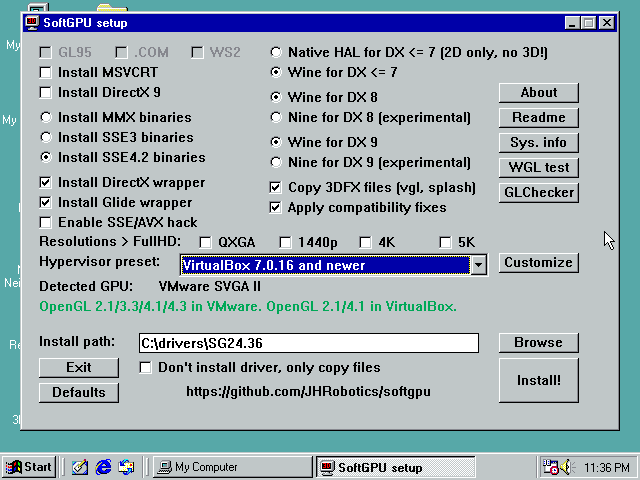

12) Click on *Install!*
13) You maybe need some reboots (after MSVCRT and DX installation) and run `softgpu.exe` again.
14) After complete and final reboot system should start in 640x480 in 256 colours or in 32-bit colours.
15) Right click on desktop, Properties -> Settings and set the resolution (which you wish for) and colours:
- to 32 bits for 98/Me, because only in 32 bit real HW screen acceleration works and applications are much faster
- to 16 bits for 95, because 95 can't set colour depth on runtime (reboot is required) and lots of old applications can't start in 32 bits (all Glide for example)
16) Verify settings:
- OpenGL: run `glchecker.exe` in `tools` on SoftGPU CD
  - If renderer is **SVGA3D**, you have HW acceleration, congratulation! If you OpenGL version is **2.1** you running on vGPU9 - most application works but none vertex/pixel shaders. If OpenGL version is **4.1** you have vGPU10 active, from SoftGPU 0.5.x this is preferred variant and most application should work.
  - If renderer is **llvmpipe**, you have still SW acceleration, but at least accelerated by SSE (128 bits) or AVX (256 bit). GPU acceleration is disabled or you real GPU isn't sporting HW acceleration.
  - If renderer is **softpipe**, you have SW acceleration and running on reference (but slow) renderer, SIMD ins't accesable somehow, or you on 95, where is softpipe renderer by default, even if SIMD hack is installed (more in Mesa9x documentation: https://github.com/JHRobotics/mesa9x).
  - If renderer is **Generic**, then ICD OpenGL DLL is not loaded. Something is wrong with system or you installed SSE instrumented binaries on no SSE enabled/supported guest.
  - If program can't start by missing `MSVCRT.DLL` install MSVCRT (part of Internet Explorer >= 4 too)
- DirectX:
  - On 98 you can run **dxdiag** (Start -> Run -> type `dxdiag`) and check all tests
  - On Me you can still run **dxdiag**, but works only DX8 and DX9 tests, because we cannot easily replace system `DDRAW.DLL`. But DX6 and DX7 games should usually run without problems
  - On 95 you can still run **dxdiag**, but if you run test, you only see black screens, but again, games (if supporting 95) games should usually run.

#### AMD Zen, 11th Generation Intel Core and newer
Newer CPU have excellent performance but needs some extra tune:
1) apply [patcher9x](https://github.com/JHRobotics/patcher9x) - this is required!
2) Change TSC (Time Stamp Counter) behaviour (Warning: this options is not available when VirtualBox is using Hyper-V as execution engine!)
```
VBoxManage setextradata "My Windows 98" "VBoxInternal/TM/TSCTiedToExecution" 1
```
3) (AMD ZEN 2+ only) Change too complex CPUID to something simpler (Windows itself is OK, but some programs may be confused - 3DMark for example)
```
VBoxManage modifyvm "My Windows 98" --cpu-profile "AMD Ryzen 7 1800X Eight-Core"
```

#### vGPU9 vs. vGPU10

There are 2 variant of graphical HW acceleration in VirtualBox 7:

**vGPU9** (9 from DirectX 9) is older variant used usually to accelerate Windows Vista/7 aero and some desktop application. On host system is drawing by DirectX 9 (Windows) or OpenGL (Linux/Mac OS). Problem is very low pixel/vertex shader support, so DirectX 8 and DirectX 9 games can't use shaders. Keep on mind that DirectX in SoftGPU is emulated by Wine, so some non-shaders applications can have problems, because some behaviour is emulated by shaders.

**vGPU10** (10 from Windows 10) is newer variant and is intended for acceleration of DirectX 12 (and DirectX 12 can emulate all older DirectX API). On host system is drawing by DirectX 12 (on Linux is translated by **dxvk** to Vulkan). Main problem is a relatively large amount of bugs ([see  summary  here](https://www.virtualbox.org/ticket/21515)). vGPU10 don't work well with SoftGPU 0.4.x releases, but SoftGPU 0.5.x solved most of problems ~and now this is preferred variant.~ vGPU9 is usually faster in DX6-8 application and with Quake 2 engine games (paradoxically vGPU10 is faster with Quake 3 engine games).

Switch between vGPU9 and vGPU10:

- Open command line
- (on Windows) navigate to VirtualBox installation directory (default: *C:\Program Files\Oracle\VirtualBox*)
- Enter this command to use **vGPU9** where *My Windows 98* is your Virtual Machine name:
```
VBoxManage setextradata "My Windows 98" "VBoxInternal/Devices/vga/0/Config/VMSVGA10" "0"
```
- This command is force use **vGPU10**:
```
VBoxManage setextradata "My Windows 98" "VBoxInternal/Devices/vga/0/Config/VMSVGA10" "1"
```
- vGPU variant is choose by VirtualBox (default) and vGPU10 is preferred if host hardware is support DX 11.1/Vulkan[^2].
```
VBoxManage setextradata "My Windows 98" "VBoxInternal/Devices/vga/0/Config/VMSVGA10" ""
```

[^2]: OK, and there some bugs, so VirtualBox is using vGPU10 even on DX10 only GPUs, so result is usually nice black screen...


### VMware Workstation setup with HW acceleration
SoftGPU with HW acceleration was tested only with lasted version of VMware Workstation (17 and 17.5), if you'll be successful with older version or free VMware player, please let me know.

#### General information
- Use **Windows 98 SE**, newer Mesa is not currently working in 95 and Windows 98 FE (first edition) hasn't supporting WDM sound cards so you might have a problem with sound.
- **Fresh install**, Windows 9x doesn't like hardware changes and if you import import VM from somewhere, strange problems may occur.
- SoftGPU is now partly compatible with **VMware additions**, when you decided to install it, please uncheck "SVGA driver".
- (optional) set as hardware compatibility to **Workstation 9.x** for vGPU9 or leave it on default level for vGPU10.

#### Step by step guide
1) Create new VM - from menu File->New Virtual Machine
2) In wizard choose *Custom (advanced)* click on next:
  - For **vGPU9** in *Hardware compatibility* select **Workstation 9.x**
  - For **vGPU10** leave *Hardware compatibility* on default choice.
  - Select *I will install the operating system later.*
  - As *Guest operating system* choice **Microsoft Windows** and as *Version* select **Windows 98** (this is optional, driver itself reporting system version)


  - Type VM name and number of processors keep on *1*
  - Set the memory to 512 MB (but without additional patches not more!)
  - Network choice is your own (default NAT should work all cases) and SCSI Controller keep on **BusLogic**
  - set *Virtual disk type* to **IDE** (important)
  - create new virtual disk and set space at last at 20 GB (but lower than 127 GB without extra patches!)
  - type or keep HDD file name and at last page before finish click on *Customize Hardware*
3) Now VM needs to be a bit reconfigure:
  - click on *Add...* and **Floppy drive**

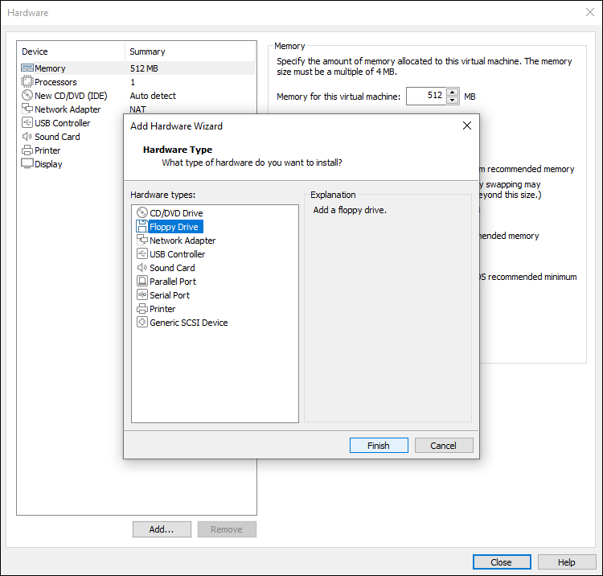

  - click on *USB Controller* and set *USB compatibility* to **USB 1.1** or remove USB controller completely
  - click on *Display* but make sure, that **Accelerate 3D graphics** is turned **off** for installation = VMware 17.x is painfully slow on 4/8-bit mode when is 3D acceleration enabled. So, turn in off for installation and turn in on after SoftGPU is installed. On VMware 17.5 this was fixed, so you can enable HW acceleration before installation.

  - (optional) click on *Printer* and click *Remove* (if you don't plan to use this feature, you'll save yourself from a pointless warning message)
  - click on *New CD/DVD (IDE)* and point *Use ISO image file* to your Windows 98 installation CD ISO.
  - (optional) click on Floppy and point *Use floppy image file* to your boot floppy (only if you plan boot floppy)
4) Click on *Close*, *Finish* and Power on machine
  - TIP: if you wish customize boot order, right click on the new VM, choose *Power* and *Power on to Firmware* - VM will boot to environment very close to common PC BIOS.

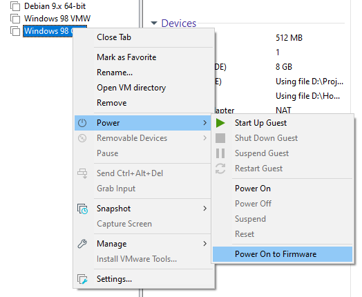

5) Install the Windows 98 - this step is really pain, VMware VM in BIOS VGA mode is hyper slow and mouse isn't usable - you have navigate through installation by keyboard (`TAB`, `Shift`+`TAB`, cursor keys, `Enter`).
	- TIP: apply [patcher9x](https://github.com/JHRobotics/patcher9x). If you have Intel 11th gen. CPU or newer or AMD Ryzen (any model) or other AMD ZEN architecture CPU and newer, this is necessary.
6) After installation isn't system very usable until you'll install GPU driver! So, insert **SoftGPU iso** (can be downloaded in Releases) and run `softgpu.exe`.
7) Set *Hypervisor preset* to **VMware Workstation (compatible)**. ("Compatible" profile install bit older Mesa but works for both vGPU9 and vGPU10).

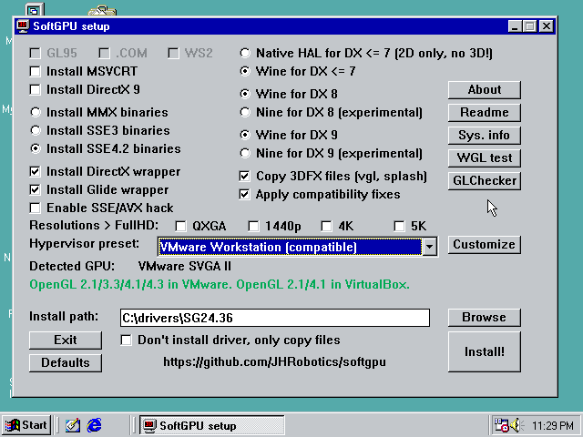

8) Click on *Install!*
9) You maybe need some reboots (after MSVCRT and DX installation) and run `softgpu.exe` again.
10) After complete and final reboot system should start in 640x480 in 32 bits per pixel colors.
11) If you have mouse trouble, open *Device Manager* (by cursor keys select *My Computer* and press `Alt`+`Enter` to open properties), then disable all *HID-compliant mouse*. Reboot VM after done!

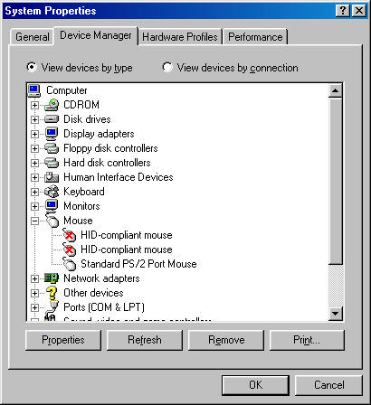

12) Turn off VM, open VM setting and under Display check **Accelerate 3D graphics**

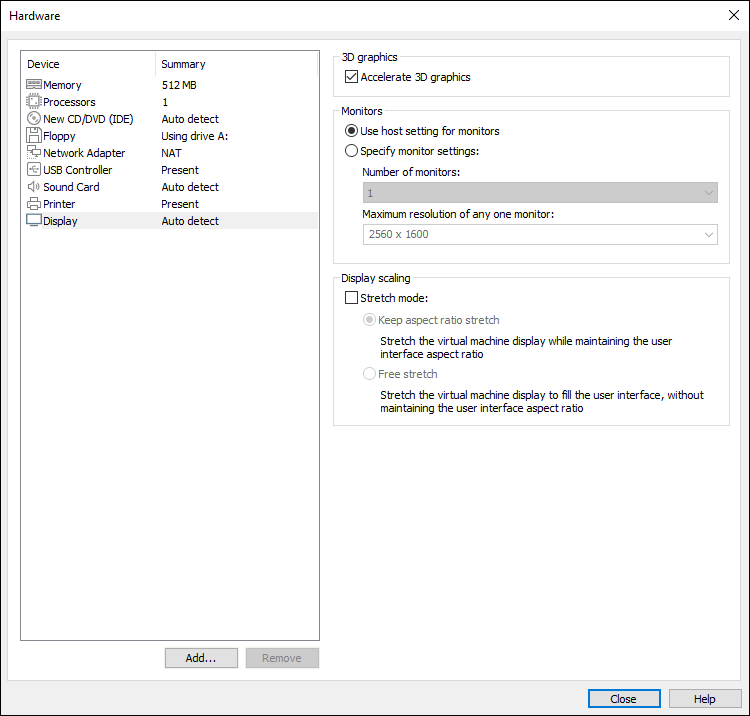

13) Start VM and use `glchecker.exe` to verify settings.


### VMware Workstation Player
VMware Workstation Player hasn't GUI option to select virtual machine version. But you can set it manually by editing `*.vmx` file:

0) Turn VM off
1) Open folder with Virtual Machine (How to locate: Right click on VM -> *setting...* -> tab *Options* -> *General* -> *Working directory*)
2) Open file `*Virtual machine name*.vmx` in text editor (for example in Notepad if you haven't something better)
3) Search for `virtualHW.version`
4) Modify line to:
```
virtualHW.version = "9"
```
(Original values are *18* for VMware 16 or *19* for VMware 17)

5) Save file, start VM and run *glchecker* to verify setting:

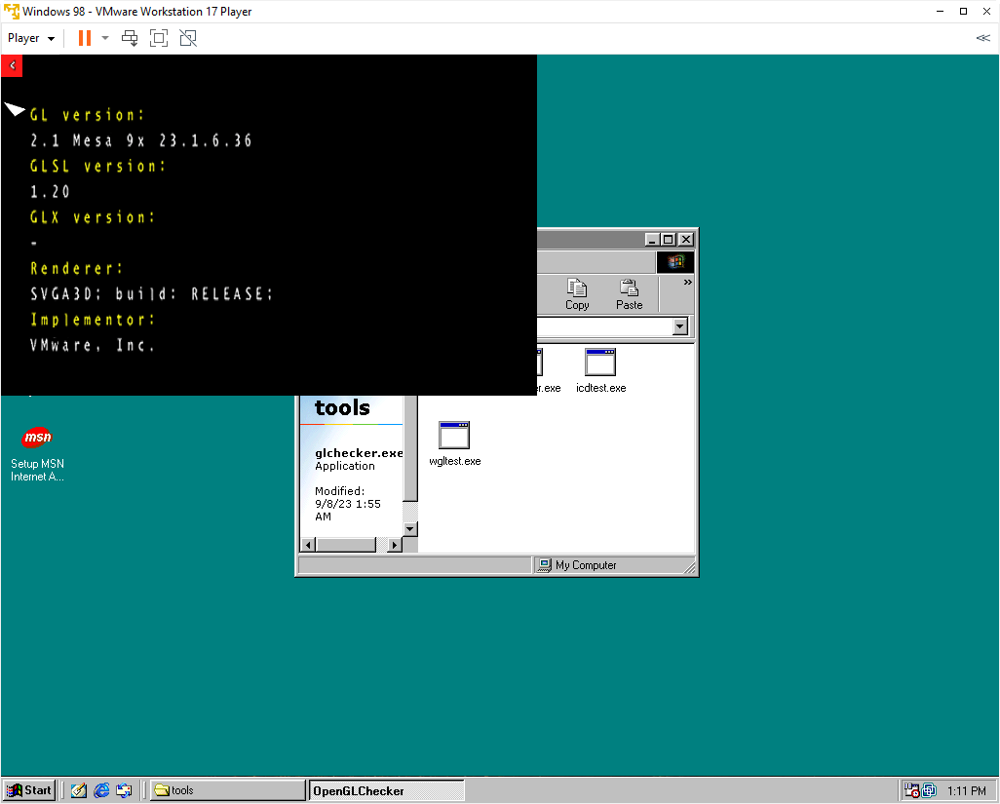


### QEMU

There is no native 3D acceleration support for QEMU yet, but you can apply QEMU-3dfx patches.

Next problem with QEMU is, that Windows 98 incorrectly detected PCI bus as PnP BIOS. There is 2 solutions for it.

#### Non-PnP BIOS

This is best for fresh installations. First you need [SeaBIOS](https://www.seabios.org/SeaBIOS) with disabled `CONFIG_PNPBIOS`. You can compile manually from source or you can use my binary: [seabios-qemu.zip](https://files.emulace.cz/seabios-qemu.zip). Extract `bios.bin` somewhere and run QEMU with '-bios /path/to/somewhere/bios.bin'. Windows 9x installation with this BIOS should detect all hardware without problems.


#### PCI bus detection fix

If you have already installed system and you don't see any PCI hardware, use these steps:

1) Open Device Manager and locate *Plug and Play BIOS* (Exclamation mark should be on it)

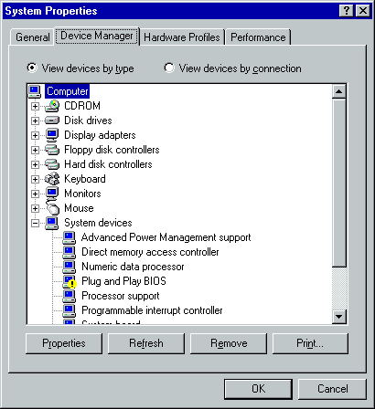

2) With this device selected click on *Properties*, select *Driver* tab and click on *Update driver*

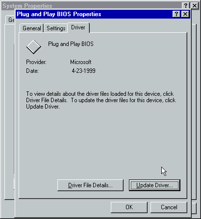

3) In Wizard select second option (*Display a list of all drivers in specific location, ...*)

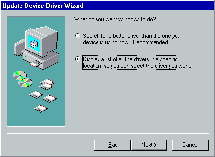

4) Select *Show all hadrware* and from models list choose **PCI bus**, click on *next*, confirm 
warning message and reboot computer.

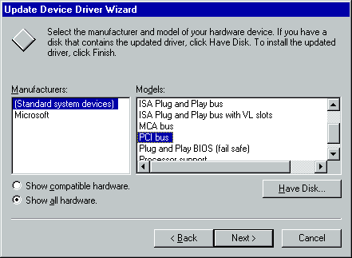
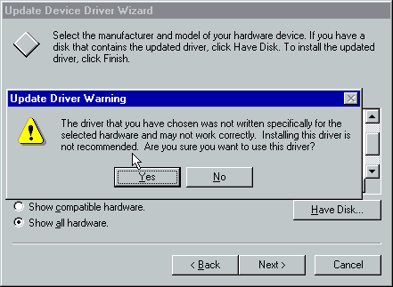

5) After reboot, system will ask you for drive on every new discovered device. All you need to do, is select *Search for the best driver...* and clicking on *next*. Please don't select new or updated drivers here - you can do it later. You may need reboot computer several times.

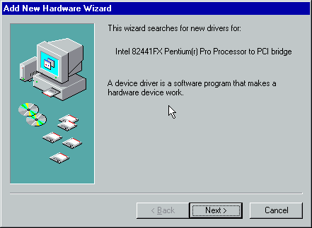


6) You will be asked for VGA driver and unknown device drivers. Still select default generic driver here!

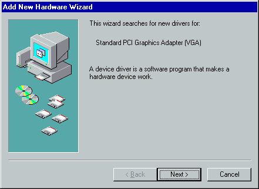
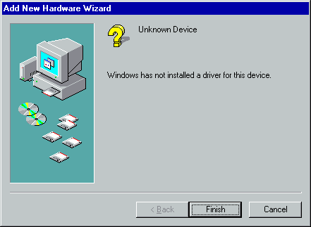

7) After last reboot open *Device manager* again - as you see, you have 2 VGA cards now, so select *Standard Display Adapter (VGA)* (the working one) and click on *Remove*.

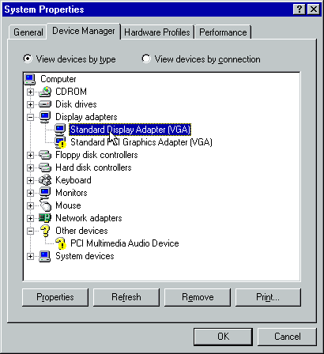

8) After reboot (again), you have working system now and you can install SoftGPU and other drivers.

#### QEMU-3dfx

1) [Built patched QEMU](https://github.com/kjliew/qemu-3dfx?tab=readme-ov-file#building-qemu)
2) Install Windows 98 with disabled CPU accelerator (it's a bit slow)
3) Check if you see PCI bus on Hardware manager
4) (optional) Install audio driver you're using AC-97
5) Mount SoftGPU ISO and install SoftGPU
6) Reboot and check if video driver works
7) Now you can shutdown VM and run again with CPU accelerator enabled
8) Now navigate to SoftGPU CD to `extras\qemu3dfx` folder and you have do set the signature:

For QEMU-3dfx need both wrapper and hypervisor same signature to works. This signature is first 7 characters from GIT revision hash. You can obtain the hash by this command in cloned qemu-3dfx repository:
```
git rev-parse HEAD
```
Binaries in SoftGPU allows to override build signature registry keys. To check that you have same signature as QEMU run `testqmfx.exe` (in `extras\qemu3dfx`). If you see error 0x45A (= ERROR_DLL_INIT_FAILED), you have wrong signature. In this case edit `set-sign.reg` (copy it from CD to writeable location) and rewrite the value `REV_QEMU3DFX` to revision hash obtain from GIT (you need only first 7 characters, retype full hash isn't necessary). After it apply file to registry (by double click on file) and run `testqmfx.exe` to check the result - you should see rotating triangle on success and see OpenGL information from your host GPU.

9) Copy `fxmemmap.vxd` and `qmfxgl32.dll` to `C:\WINDOWS\SYSTEM` and apply file `icd-enable.reg` (this tells to driver using `qmfxgl32.dll` when system `opengl32.dll` ask about OpenGL driver).
10) reboot (**required**)
11) run *GLchecker* or some other 3D application to verify settings.


## Bugs
Currently there are known these limitations:

### Vertex Shaders
**Update for 0.5.x versions**: Vertex Shaders works on vGPUv10 (VirtualBox 7) and for qemu-3dfx. For vGPU9 (VMware, VirtualBox 6.1) are DirectX shaders disabled, so most of applications can use shader alternative (most of DX8 games lots of DX9).

### Windows 95 support
Windows 95 support is limited - SoftGPU works, but there lots of extra bugs will appear and if you haven't any special reasons for using Windows 95 use recommended Windows 98 Second edition instead.

### Other bugs
There are many bugs in individual components, please post them to individual repositories based on bugged application (DirectX, Glide, OpenGL).

But still, please be patient. SoftGPU compatibility target is about a decade of intensive HW and SW development (from DOS direct VGA/VESA access, SW rendering through GDI, DirectDraw, OpenGL, Glide, DirectX, OpenGL again). After all, there will still applications that cannot be run anyway because there are written for very individual SW/HW combinations.

## General tips
There are some tips without direct relation to SoftGPU but they can improve the user experience with MS Windows 9x OS.

### Fresh install
Prefer new installation over copy older installations done on different (even virtual) HW.

### Copy Installation to HDD before run setup
If you installed Windows 9x from CD, on near every system change your will be asked to insert Install CD. You can avoid it if you prepare HDD manually, copy installation from CD and run `setup.exe` from `C:` drive.

All utilities you need are on [patcher9x](https://github.com/JHRobotics/patcher9x) boot floppy. The short procedure follows:

- insert *patcher9x* floppy to floppy driver and Windows Installation CD to CD driver. Boot from floppy drive
- run `fdisk` and create primary dos partition (it wizard type program, just keep pressing `1`, `Y` and finally `ESC`).
- reboot after `fdisk` finish
- format HDD, copy files, install necessary patches and run the setup using following commands:
```
format C:
xcopy /v D:\win98\ C:\install\win98\
patch9x C:\install\win98 -auto
C:
cd install\win98
setup /ie /nm
```
Explanation: The `/v` switch with `xcopy` means *verify*. The `/ie` switch with `setup` means *skip recovery floppy creation* and `/nm` means *no machine check* - this is necessary because in Patcher9x boot floppy is using FreeDOS and MS setup program cannot determine RAM size without MS memory manager.

Now *setup* automatically runs `scandisk` and after complete it you can continue with installer GUI. You can also remove floppy and CD from drive at this point.

### Turn on DMA
Windows by default using interrupts to access HDD and CD drive. This is especially slow in the HW accelerated virtual machines because every interrupt will stop executing visualisation engine and hand over access to hypervisor to solve it and after that it'll be need to restart visualisation engine again. Time consumed by interrupts depends on visualization technology for example in QEMU + kvm is HDD access very slow equally VirtualBox + Hyper-V and combination QEMU + Hyper-V is downright painful. Fortunately there is DMA transfer of whole memory block instead of individual bytes. Unfortunately you have to enable it manually.

You can turn it on in Device Manager on HDD properties enable `DMA` checkbox. Do it the same for CD driver and reboot VM for applying changes.


### Change logon to Windows Logon
After install network card you are asked every time to enter the credentials - but this is not credentials to the computer but to the network (you can also skip this by press `ESC`). If you don't plan to install NT server as other VM and runs ancient network sharing, this is only annoying thing. You can turn it off in *Control panel* -> *Network* and change *Primary network logon* to **Windows Logon**.


## Extra drivers
These are links to some extra drivers for VM:
- [AC97 (version 3.62)](https://files.emulace.cz/ac97_362.zip) - for QEMU and VirtualBox
- [SB PCI 128](https://files.emulace.cz/sbpci_98se.exe) - for VMware Workstation
- [VMware mouse driver](https://files.emulace.cz/vmmouse.zip) ([floppy version](https://files.emulace.cz/vmmouse.ima))

If you wish download these drivers from Windows 9x directly, you can use these links (simply replace https -> http):
```
http://files.emulace.cz/ac97_362.zip
http://files.emulace.cz/sbpci_98se.exe
http://files.emulace.cz/vmmouse.zip
```

If you need tool for decompressing ZIP and other archives, there is 7-Zip in version with Windows 98 compatible:
```
http://files.emulace.cz/7z920.exe
```


## Runtime configuration

There a few registry keys to configure SoftGPU and its component, more on [softgpu.md](softgpu.md) or *softgpu.html* on SoftGPU CD.


## Compilation from source (outdated)
1) You need MINGW and *GNU make* to build *softgpu.exe*
2) You need all development tool to compile all other component (see README.md in individual repositories)
3) Compile softgpu.exe by type `make`
4) Compile VMDisp9x and copy files `boxvmini.drv`, `vmwsmini.drv`, `qemumini.drv`, `vmwsmini.vxd`, `vmdisp9x.inf` and place them to `driver/win95` and `driver/win98me` folder
5) Compile Mesa9x for Windows 95 (e.g., without SSE) and copy and rename files to following schema
   - `vmwsgl32.dll`       => `driver/win95/vmwsgl32.dll`
   - `opengl32.w98me.dll` => `driver/win95/extra/opengl32.dll`
   - `mesa3d.w98me.dll`   => `driver/win95/mesa3d.dll`
   - `glchecker.exe`      => `tools/glchecker.exe`
   - `icdtest.exe`        => `tools/icdtest.exe`
   - `wgltest.exe`        => `tools/wgltest.exe`
   - [folder] `glchecker` => `tools/glchecker`
6) Compile Mesa9x for Windows 98 and Me (eq. with SSE, optimized for Core2 or Westmere) and copy these files
   - `vmwsgl32.dll`       => `driver/win98me/vmwsgl32.dll`
   - `opengl32.w98me.dll` => `driver/win98me/extra/opengl32.dll`
   - `mesa3d.w98me.dll`   => `driver/win98me/mesa3d.dll`
7) Compile Wine9x for Windows 95 and copy
   - `ddraw.dll`          => `driver/win95/ddraw.dll`
   - `ddrawme.dll`        => `driver/win95/ddrawme.dll`
   - `d3d8.dll`           => `driver/win95/d3d8.dll`
   - `d3d9.dll`           => `driver/win95/d3d9.dll`
   - `dwine.dll`          => `driver/win95/dwine.dll`
   - `wined3d.dll`        => `driver/win95/wined3d.dll`
8) Compile Wine9x for Windows 98+Me and copy
   - `ddraw.dll`          => `driver/win98me/ddraw.dll`
   - `ddrawme.dll`        => `driver/win95/ddrawme.dll`
   - `d3d8.dll`           => `driver/win98me/d3d8.dll`
   - `d3d9.dll`           => `driver/win98me/d3d9.dll`
   - `dwine.dll`          => `driver/win98me/dwine.dll`
   - `wined3d.dll`        => `driver/win98me/wined3d.dll`
9) make `ddreplacer.exe` (by typing make ddreplacer.exe in Wine9x)
10) Extract original ddraw.dll from DX8 redistributable for W95 and type
```
ddreplacer path/to/extracted/ddraw.dll ddr95.dll
```
   - copy `ddr95.dll` => `driver/win95/dx/ddr95.dll`
   - copy `ddr95.dll` => `driver/win98me/dx/ddr95.dll`
11) Extract original ddraw.dll from newer DX9 redistributable (doesn't matter if it's final one, this file doesn't seem to change often) and type
```
ddreplacer path/to/extracted/ddraw.dll ddr98.dll
```
   - copy `ddr98.dll` => `driver/win95/dx/ddr98.dll`
   - copy `ddr98.dll` => `driver/win98me/dx/ddr98.dll`
12) Compile OpenGlide9x for Windows 95 and copy
   - `glide2x.dll`        => `driver/win95/glide2x.dll`
   - `glide3x.dll`        => `driver/win95/glide3x.dll`
13) Compile OpenGlide9x for Windows 98 and copy
   - `glide2x.dll`        => `driver/win98me/glide2x.dll`
   - `glide3x.dll`        => `driver/win98me/glide3x.dll`
14) Edit both `driver/win95/vmdisp9x.inf` and `driver/win98me/vmdisp9x.inf` and uncomment files and that you added. CopyFiles options have to look like:
```
CopyFiles=VBox.Copy,Dx.Copy,DX.CopyBackup,Voodoo.Copy
```
and
```
CopyFiles=VMSvga.Copy,Dx.Copy,DX.CopyBackup,Voodoo.Copy
```
and
```
CopyFiles=Qemu.Copy,Dx.Copy,DX.CopyBackup,Voodoo.Copy
```

15) place redistributable to redist folder
16) Edit `softgpu.ini` for final paths review
17) Create ISO file place to it:
   - file `softgpu.exe`
   - file `softgpu.ini`
   - folder `driver`
   - folder `redist`
   - folder `tools`
   - *readme* and *licence* file
18) Mount ISO to virtual machine and enjoy it!
