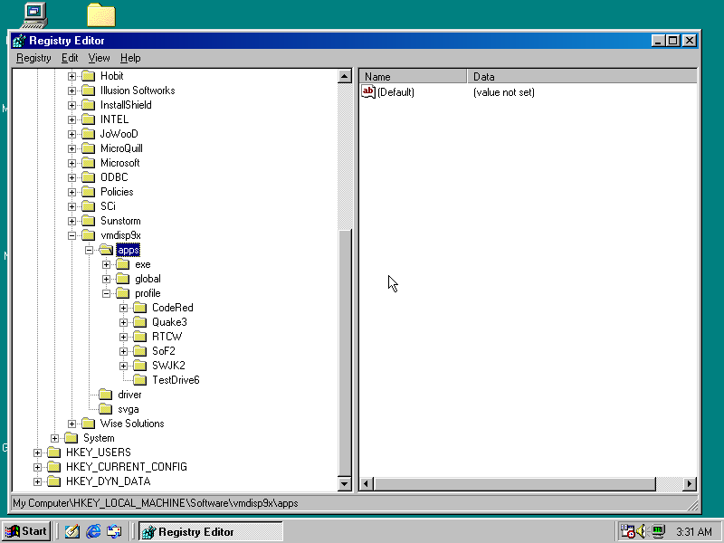

# Runtime configuration

All component settings are stored in registry under `HKEY_LOCAL_MACHINE\Software\vmdisp9x` key.

Also plan create some configuration utility (beside) installer, but work on it has very low priority.

So every setting you needs to do thought registry editor (`regedit.exe`) or by insertion `*.reg` files by double click.



Setting tree is following:

```
HKEY_LOCAL_MACHINE\Software\vmdisp9x
  + apps
    + global = setting to all applications
       + hal = global setting for native DX/DD driver
       + mesa = global setting for Mesa
       + openglide = global setting for OpenGlide
       + wine = global setting for Wine
       - ddraw = global map to DD/DX7 runtime
       - d3d8 = global map to DX8 runtime
       - d3d9 = global map to DX9 runtime       
    + exe = setting to individual exe (identified by exe name)
      + <exe name>
         + hal = individual setting for HAL
         + mesa
         + openglide
         + wine
         - ddraw = per application DD/DX7 runtime selection
         - d3d8
         - d3d9
    + profile = complex profiles (identified by path with regex)
      + <profile name>
         - path = regex of path to exe
         - name = profile name
         - desc = short description
         + hal
         + mesa
         + openglide
         + wine
         - ddraw
         - d3d8
         - d3d9
  + driver = universal display settings
  + svga = display settings related to VMware SVGA-II gpu
```

NOTE: you can enter numeric values as DWORD or as string, it'll be converted automatically.

## Universal display settings

| Name              | Default value | Desctiption |
| ----------------- | -----------   | ----------- |
| FORCE_SOFTWARE    | 0             | 1 to use software OpenGL even if there is HW accelerated |
| FORCE_QEMU3DFX    | 0             | 1 when you has working QEMU-3Dfx wrapper |
| REV_QEMU3DFX      | (empty)       | tag to override driver default (build-in) |
| GAMMA_QUIRK       | 0             | 0 - auto detect gamma range |
|                   |               | 1 - gamma in range 0 - 127 |
|                   |               | 2 - gamma in range 0 - 255 |
| OVERLAY_n_SIZE    | 0             | define region on VRAM that can be used as frame buffer, but without notify the system - for example simulate relay on Voodoo cards. |

## SVGA driver

| Name              | Default value | Desctiption |
| ----------------- | -----------   | ----------- |
| HWCursor          | 0             | 1 enable HW cursor, 0 draw cursor by software |
| VRAMLimit         | 128           | limits maximum of VRAM (for Win9x maximum around 256) | 
| CommandBuffers    | 1             | enable newer style commands (on vGPU10 must be enabled) |
| PreferFIFO        | 1             | prefer FIFO over command buffer when is possible |
| RGB565bug         | 0             | fix VB 6.1 bug when RGB565 formats has wrong flags |
| HWVersion         | 2             | 2 = SVGA_VERSION_2  |
| NoMultisample     | 1             | disable multisample (vmware bug) |
| RegMultisample    | 0             | value to SVGA_REG_MSHINT register |
| AsyncMOBs         | 1             | number of MOBs to be created simulately |
| NoScreenAccel     | 0             | when enable, all frame buffer operation will be done strictly by CPU |


## HAL

| Name              | Per application | Default value | Description |
| ----------------- | --------------- | -----------   | ----------- |
| ddi               | **global only** | 8             | set DDI level, values can be 0, 3, 5, 6. 7, 8 |
| hwtl              | **global only** | 8             | enable HW T&L in ddi level: 8 - HW T&L in DX 9, 8, 7; 7 - HW T&L in DX 7 only; 0 - HW T&L disabled |
|forceos            | **global only** | 0             | force to use software rasterisation |
| sysmem            | **global only** | 0             | force to allocate surfaces in RAM |
| vertexblend       | **global only** | 0             | allow to emulate DX vertex blend (slow and buggy) |
| palette           | **global only** | 0             | allow to use indexed palette textures (buggy in some games) |
| readback          | yes             | 0             | when 1, render output is read back to  surface, slow, but keep for compatibility |
| touchdepth        | yes             | 0             | when 1, depth buffer is read and write from and to surface, slow, only need when application needs manipulate with depth buffer |
| filter_bug        | yes             | auto          | SVGA driver has bug when filtering isn't applied correctly |
| s3tc_bug          | yes             | 1             | software conversion of S3 style compressed textures |


## MESA

"MESA_EXTENSION_MAX_YEAR"="2000"
"LP_NATIVE_VECTOR_WIDTH"="256"


## OpenGlide

"Disabled"="1"
"FogEnable"="1"
"InitFullScreen"="0"
"Textures32bit"="1"
"HideCursor"="2"
"NoSplash"="0"
"SwapInterval"="0"
"Resolution"="2"

"NumTMU"="2"
"SSTType="3"
"TextureMemorySize"="4"
"FrameBufferMemorySize"="4"


## WINE

"VideoMemorySize"="256"

## Examples

Where are example how registry configuration work, you can save there example as text file with REG extension and apply them on double click or open `regedit.exe` edit these value directly (create these key when missing).


### Hypervisors bugs override

```
REGEDIT4


[HKEY_LOCAL_MACHINE\vmdisp9x\svga]
;
; For 565 format were reported bad attributes
; You can disable it if you have:
;  VirtualBox >= 6.1.46
;  VirtualBox >= 7.0.10
"RGB565bug"=dword:00000001
;
; Vmware sometime freeze when Command Buffers are used.
; This using older way to send commands to GPU.
; You turn off for VirtualBox, bud vGPU9 is slightly waster
; when using FIFO. This option have no effect to vGPU10
"PreferFIFO"=dword:00000001
;
; Disable multisampling (antialiasing) support, for example
; on VMware GPU10 where it's not working properly.
"NoMultisample"=dword:00000001

[HKEY_LOCAL_MACHINE\Software\Mesa3D\global]
; VirtualBox 7.0.14 and older has broken some DirectX flags,
; this fix it.
"SVGA_CLEAR_DX_FLAGS"="1"
;
; Hard FPS limit, not precise, value 80 equals real ~60 FPS
"FRAMERATE_LIMIT"=80
;
; Allow rendering by SVGA_3D_CMD_BLIT_SURFACE_TO_SCREEN
; SVGA command. Works only in VirtualBox, improve speed.
"SVGA_BLIT_SURF_TO_SCREEN"=1
;
; VirtualBox has bug, when DMA operation with VRAM not
; refresh host frame buffer, in 16bpp also not working
; refreshing command, so only option is read and write
; VRAM back by CPU or use offscreen rendering with
; software blit. Can be disabled on VMware to
; improve 16bpp rendering.
"SVGA_DMA_NEED_REREAD"=0

```


### Universal driver configuration
```
REGEDIT4


[HKEY_LOCAL_MACHINE\Software\vmdisp9x\driver]
;
; set 1 to use software OpenGL event there is some accelerated
"FORCE_SOFTWARE"=dword:00000000
;
; set 1 when you has working QEMU-3Dfx wrapper
"FORCE_QEMU3DFX"=dword:00000000


```

### SVGA driver configuration

```
REGEDIT4


[HKEY_LOCAL_MACHINE\Software\vmdisp9x\svga]
;
; Limit mapping of VRAM in MB. For Windows 9x is limit
; around 300 MB and if you attach more, system will crash.
; But keep on might that VRAM is almost unutilized and if you
; don't need 8k resolution isn't reason why increase this value.
"VRAMLimit"=dword:00000080
;
; set 0 to disable command buffer support, use FIFO instead.
; For debug only.
"CommandBuffers"=dword:00000001
; 
; Allow parallel creation of memory objects (like textures or vertex buffers)
; without sync GPU between them. Not recommended now, vGPU can be unstable with this.
"AsyncMOBs"=dword:00000004
;
; Screen target surface size (in MB). Virtual frame buffer is normally periodically
; or on demand copied do host memory and then copied to GPU or render pure by software.
; This option create system frame buffer as GPU surface. 3D operation are faster,
; but software operation slower. Very experimental.
;
"STSize"=dword:00000040
;
; Bitfield to configure screen target usage, flags
; 0x01 - screen target usage for 16bpp screen. This allow screen acceleration on 16bpp
;        but not supported by VirtualBox now
; 0x02 - accelerate mouse cursor (currently broken in VirtualBox)
; 0x04 - fast show and hide cursor commands (bugged in VirtualBox)
;
"STOptions"=dword:00000002

```


### DirectX/DirectDraw wrapper selection

Some application won't work or not working well with Wine, for 2D application you can use native DirectDraw HAL. Media player is one of them:

```
REGEDIT4


[HKEY_LOCAL_MACHINE\Software\vmdisp9x\apps\exe\MPLAYER2.exe]
"ddraw"="system"

```

Some 2D games have these problems to, for example The Sims:

```
REGEDIT4


[HKEY_LOCAL_MACHINE\Software\vmdisp9x\apps\exe\sims.exe]
"ddraw"="system"

```

You can also select native DirectDraw HAL by default, and turn on wine for individual applications:

```
REGEDIT4


[HKEY_LOCAL_MACHINE\Software\vmdisp9x\apps\global]
"ddraw"="system"

[HKEY_LOCAL_MACHINE\Software\vmdisp9x\apps\exe\rayman2.exe]
"ddraw"="wine"

```

For DX8 and DX9 you can switch between HEL (there isn't native DirectX HAL) - but application needs support software/emulated rendering, Wine or Nine (Mesa DirectX 9 driver). Using Nine for DX8 (when is supported) game (Mafia):

```
REGEDIT4


[HKEY_LOCAL_MACHINE\Software\vmdisp9x\apps\exe\game.exe]
"d3d8"="nine"

```

Nine for DX9 game (CMR 3):

```
REGEDIT4


[HKEY_LOCAL_MACHINE\Software\vmdisp9x\apps\exe\Rally_3PC.exe]
"d3d9"="nine"

```

Supported values are: *system* (pass calls to system DLL), *wine* (using Wine9x), *nine* (use nine for DX9 when is supported), *ninemore* (Nine for DX 8 and DX 9), *nineforce* (try use Nine even when looks like unsupported) or value can be name of DLL (with path or only file name) to wrapper DLL (can be used for example with SwiftShader).

### Mesa3D

Old OpenGL games have problem with too large extension string Quake II is on of them:

```
REGEDIT4

[HKEY_LOCAL_MACHINE\Software\vmdisp9x\apps\exe\quake2.exe\mesa]
"MESA_EXTENSION_MAX_YEAR"="2000"
```

When you using software rendering and [SIMD95](https://github.com/JHRobotics/simd95) for enable AXV instruction set, it is recommended to use them only with one application Q3 for example:

```
REGEDIT4

[HKEY_LOCAL_MACHINE\Software\vmdisp9x\apps\exe\quake2.exe\mesa]
"LP_NATIVE_VECTOR_WIDTH"="256"
```

Possible configuration values here are: https://docs.mesa3d.org/envvars.html

### Wine

Default Wine registry path also working: https://wiki.winehq.org/Useful_Registry_Keys

But also working same registry path scheme as for Mesa, for example increase VRAM memory to 256 MB (Video RAM is emulated anyway, you can use any value when you have enough system RAM):


```
REGEDIT4

[HKEY_LOCAL_MACHINE\Software\vmdisp9x\apps\global\wine]
"VideoMemorySize"="256"
```


### QEMU 3DFX

```
REGEDIT4


[HKEY_LOCAL_MACHINE\Software\vmdisp9x\driver]
; override signature in QEMU-3dfx driver
; you can obtain current signature by command:
; git rev-parse HEAD
; (only first 7 characters needed)
; you need same signature as QEMU-3dfx which you used to 
; build QEMU
;
"REV_QEMU3DFX"="3258e4a30"
;
; When you have working QEMU-3dfx this key enable
; ICD OpenGL driver
"FORCE_QEMU3DFX"=dword:00000001

```

### OpenGlide

```
REGEDIT4


[HKEY_LOCAL_MACHINE\Software\vmdisp9x\apps\exe\Rayman2.exe\openglide]
;
; disable OpenGlide for some application
; very useful if you wish ship glide usage
; and continue for normal OpenGL
"Disabled"="1"
;
; Enable the fog, this is broken now
; but you can try it...
"FogEnable"="1"
;
; Run game in window
"InitFullScreen"="0"
;
; Convert all textures to ARGB8888 instead of
; 16-bit types. Speeds up a bit sometimes.
"Textures32bit"="1"
;
; Disable system cursor:
; 0 - cursor present
; 1 - cursor is disabled in glide window (default)
; 2 - cursor is disabled in whole system when app running
"HideCursor"="2"
;
; Disable 3DFX splash screen:
; 0 - splash is disabled for good
; 1 - always show splash screen, original 3DFX if
;     there are presents `3dfxSpl2.dll` and `3dfxSpl3.dll`
;     or OpenGlide build-in splash screen
; 2 - show only original splash screen or nothing (default)
"NoSplash"="0"
;
; Disable OpenGL vertical sync for OpenGL
; some games cannot handle it and they're too fast
;  0 - v-sync disabled
;  1 - v-sync enabled (60 FPS, default)
; -1 - v-sync adaptive (may not be supported)
"SwapInterval"="0"
;
; Scale resolution
; for example:
; 2   - 800x600 => 1600x1200
; 2.5 - 640x480 => 1600x1200
; 
"Resolution"="2"

```

You can also tune the configuration of Voodoo board

```
REGEDIT4


[HKEY_LOCAL_MACHINE\Software\vmdisp9x\apps\global\openglide]
;
; Number of texture mapping units, default is 1
; because on original HW both TMUs can be configure
; differently, but OpenGlide not support that and 
; only TMU#1 configuration is taken into account
"NumTMU"="2"
;
; Type of Voodoo board:
; -1 - auto selection (default)
;  0 - Voodoo
;  1 - Rush
;  3 - Voodoo2
;  4 - Banshee
; Default is Voodoo 2 for Glide2x and Banshee for Glide3x API
SSTType="3"
;
; Memory for one TMU in MB
; default: 8
"TextureMemorySize"="4"
;
; Memory for frame buffer in MB
; 4  - max. resolution 800x600
; 8  - max. resolution 1200x1024
; 16 - max. resolution 1600x1200
; default: 8
; original cards had 4 or 8 MB of FB memory. If you need
; large screen is better to scale resolution instead of
; use more memory
"FrameBufferMemorySize"="4"
;
; Note: OpenGlide architecture is most analogous to
;       Voodoo Banshee - FB and TMUs are in same linear       
;       memory space
;

```
