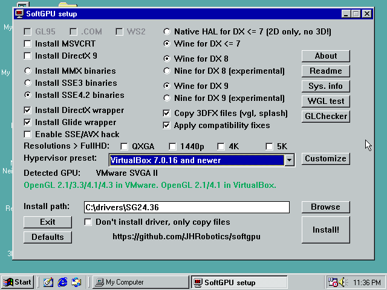

# VirtualBox


## VirtualBox VM setup with HW acceleration
1) Create new VM selecting *Machine -> New* in menu
2) Type: Microsoft Windows, Version: Windows 98
3) Base memory: **512 MB** (this is minimum (for vGPU10), but more 512 MB isn't recommended without additional patches!), CPU: 1
4) Disk size: recommended is at least 20 GB for 98/Me (you can select less, but HDD becomes full faster). Select 2 GB if you plan install Windows 95. Tip: If you storing virtual machine on classic HDD, check *Pre-allocate Full Size*, because it leads to lower disk image fragmentation.
5) Finish wizard
6) Open VM setting
- In **General** change *type* to **Linux** and *version* to **Other Linux (32-bit)** => This setting haven't any effect to hardware configuration but allow you to set GPU type through GUI.
- Now in *Display*
  - Set *Graphic Controller* to **VMSVGA**
  - set video memory to **128 MB** (VBox sometimes turn off GPU HW acceleration if this value is lower). More on [this issue](https://github.com/JHRobotics/vmdisp9x/issues/2) and more about [VRAM usability](https://github.com/JHRobotics/vmdisp9x#vram-size).
  - Check **enable 3D Acceleration**
7) Optional adjustment
- set USB controller to USB 1.1 (OHCI) for 98/Me, or turn USB off for 95
- Audio controller set to **SoundBlaster 16** for 95 ~and 98~ or **AC 97** for 98 and Me (working drivers for Windows 98 are [below](#extra-drivers)).
8) Install system - Windows 98 SE is highly recommended (for newer CPU, you need my patch: https://github.com/JHRobotics/patcher9x)
9) Optional increase memory - especially vGPU10 driver is relative heavy about RAM usage. Apply **PATCHMEM by rloew**, after it you can increase base RAM (768 MB or 1024 MB should be enough)
10) Insert SoftGPU iso (can be downloaded in Releases) and run `softgpu.exe`
11) Select profile match to your VirtualBox version



12) Click on *Install!*
13) You maybe need some reboots (after MSVCRT and DX installation) and run `softgpu.exe` again.
14) After complete and final reboot system should start in 640x480 in 256 colours or in 32-bit colours.
15) Right click on desktop, Properties -> Settings and set the resolution (which you wish for) and colours:
- to 32 bits for 98/Me, because only in 32 bit real HW screen acceleration works and applications are much faster
- to 16 bits for 95, because 95 can't set colour depth on runtime (reboot is required) and lots of old applications can't start in 32 bits (all Glide for example)
16) Verify settings:
- OpenGL: run `glchecker.exe` in `tools` on SoftGPU CD
  - If renderer is **SVGA3D**, you have HW acceleration, congratulation! If you OpenGL version is **2.1** you running on vGPU9 - most application works but none vertex/pixel shaders. If OpenGL version is **4.1** you have vGPU10 active, from SoftGPU 0.5.x this is preferred variant and most application should work.
  - If renderer is **llvmpipe**, you have still SW acceleration, but at least accelerated by SSE (128 bits) or AVX (256 bit). GPU acceleration is disabled or you real GPU isn't sporting HW acceleration.
  - If renderer is **softpipe**, you have SW acceleration and running on reference (but slow) renderer, SIMD ins't accesable somehow, or you on 95, where is softpipe renderer by default, even if SIMD hack is installed (more in Mesa9x documentation: https://github.com/JHRobotics/mesa9x).
  - If renderer is **Generic**, then ICD OpenGL DLL is not loaded. Something is wrong with system or you installed SSE instrumented binaries on no SSE enabled/supported guest.
  - If program can't start by missing `MSVCRT.DLL` install MSVCRT (part of Internet Explorer >= 4 too)
- DirectX:
  - On 98 you can run **dxdiag** (Start -> Run -> type `dxdiag`) and check all tests
  - On Me you can still run **dxdiag**, but works only DX8 and DX9 tests, because we cannot easily replace system `DDRAW.DLL`. But DX6 and DX7 games should usually run without problems
  - On 95 you can still run **dxdiag**, but if you run test, you only see black screens, but again, games (if supporting 95) games should usually run.

#### AMD Zen, 11th Generation Intel Core and newer
Newer CPU have excellent performance but needs some extra tune:
1) apply [patcher9x](https://github.com/JHRobotics/patcher9x) - this is required!
2) Change TSC (Time Stamp Counter) behaviour (Warning: this options is not available when VirtualBox is using Hyper-V as execution engine!)
```
VBoxManage setextradata "My Windows 98" "VBoxInternal/TM/TSCTiedToExecution" 1
```
3) (AMD ZEN 2+ only) Change too complex CPUID to something simpler (Windows itself is OK, but some programs may be confused - 3DMark for example)
```
VBoxManage modifyvm "My Windows 98" --cpu-profile "AMD Ryzen 7 1800X Eight-Core"
```

#### vGPU9 vs. vGPU10

There are 2 variant of graphical HW acceleration in VirtualBox 7:

**vGPU9** (9 from DirectX 9) is older variant used usually to accelerate Windows Vista/7 aero and some desktop application. On host system is drawing by DirectX 9 (Windows) or OpenGL (Linux/Mac OS). Problem is very low pixel/vertex shader support, so DirectX 8 and DirectX 9 games can't use shaders. Keep on mind that DirectX in SoftGPU is emulated by Wine, so some non-shaders applications can have problems, because some behaviour is emulated by shaders.

**vGPU10** (10 from Windows 10) is newer variant and is intended for acceleration of DirectX 12 (and DirectX 12 can emulate all older DirectX API). On host system is drawing by DirectX 12 (on Linux is translated by **dxvk** to Vulkan). Main problem is a relatively large amount of bugs ([see  summary  here](https://www.virtualbox.org/ticket/21515)). vGPU10 don't work well with SoftGPU 0.4.x releases, but SoftGPU 0.5.x solved most of problems ~and now this is preferred variant.~ vGPU9 is usually faster in DX6-8 application and with Quake 2 engine games (paradoxically vGPU10 is faster with Quake 3 engine games).

Switch between vGPU9 and vGPU10:

- Open command line
- (on Windows) navigate to VirtualBox installation directory (default: *C:\Program Files\Oracle\VirtualBox*)
- Enter this command to use **vGPU9** where *My Windows 98* is your Virtual Machine name:
```
VBoxManage setextradata "My Windows 98" "VBoxInternal/Devices/vga/0/Config/VMSVGA10" "0"
```
- This command is force use **vGPU10**:
```
VBoxManage setextradata "My Windows 98" "VBoxInternal/Devices/vga/0/Config/VMSVGA10" "1"
```
- vGPU variant is choose by VirtualBox (default) and vGPU10 is preferred if host hardware is support DX 11.1/Vulkan[^2].
```
VBoxManage setextradata "My Windows 98" "VBoxInternal/Devices/vga/0/Config/VMSVGA10" ""
```

[^2]: OK, and there some bugs, so VirtualBox is using vGPU10 even on DX10 only GPUs, so result is usually nice black screen...
