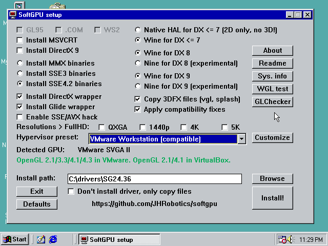

# VMware

## VMware Virtual Machine HW compatibility

| Level    | GPU generation | OpenGL version | HW 3D in SoftGPU |
| :------- |:-------------: | :------------- | :--------------- |
| 17.x     | vGPU10         | 4.1, 4,3       | ✔                |
| 16.x     | vGPU10         | 4.1            | ✔                |
| ESXi 7.0 | vGPU10         | 3.3            | ✔                |
| 15.x     | vGPU10         | 3.3            | ✔                |
| 14.x     | vGPU10         | 3.3            | ✔                |
| ESXi 6.5 | vGPU10         | 3.3            | ✔                |
| 12.x     | vGPU10         | 3.3            | ✔                |
| 11.x     | vGPU10         | -              | ❌               |
| 10.x     | vGPU9          | 2.1            | ✔                |
| 9.x      | vGPU9          | 2.1            | ✔                |


## VMware Workstation setup with HW acceleration
SoftGPU with HW acceleration was tested only with lasted version of VMware Workstation (17 and 17.5), if you'll be successful with older version or free VMware player, please let me know.

#### General information
- Use **Windows 98 SE**, newer Mesa is not currently working in 95 and Windows 98 FE (first edition) hasn't supporting WDM sound cards so you might have a problem with sound.
- **Fresh install**, Windows 9x doesn't like hardware changes and if you import import VM from somewhere, strange problems may occur.
- SoftGPU is now partly compatible with **VMware additions**, when you decided to install it, please uncheck "SVGA driver".
- (optional) set as hardware compatibility to **Workstation 9.x** for vGPU9 or leave it on default level for vGPU10.

#### Step by step guide
1) Create new VM - from menu File->New Virtual Machine
2) In wizard choose *Custom (advanced)* click on next:
  - For **vGPU9** in *Hardware compatibility* select **Workstation 9.x**
  - For **vGPU10** leave *Hardware compatibility* on default choice.
  - Select *I will install the operating system later.*
  - As *Guest operating system* choice **Microsoft Windows** and as *Version* select **Windows 98** (this is optional, driver itself reporting system version)


  - Type VM name and number of processors keep on *1*
  - Set the memory to 512 MB (but without additional patches not more!)
  - Network choice is your own (default NAT should work all cases) and SCSI Controller keep on **BusLogic**
  - set *Virtual disk type* to **IDE** (important)
  - create new virtual disk and set space at last at 20 GB (but lower than 127 GB without extra patches!)
  - type or keep HDD file name and at last page before finish click on *Customize Hardware*
3) Now VM needs to be a bit reconfigure:
  - click on *Add...* and **Floppy drive**


  - click on *USB Controller* and set *USB compatibility* to **USB 1.1** or remove USB controller completely
  - click on *Display* but make sure, that **Accelerate 3D graphics** is turned **off** for installation = VMware 17.x is painfully slow on 4/8-bit mode when is 3D acceleration enabled. So, turn in off for installation and turn in on after SoftGPU is installed. On VMware 17.5 this was fixed, so you can enable HW acceleration before installation.

  - (optional) click on *Printer* and click *Remove* (if you don't plan to use this feature, you'll save yourself from a pointless warning message)
  - click on *New CD/DVD (IDE)* and point *Use ISO image file* to your Windows 98 installation CD ISO.
  - (optional) click on Floppy and point *Use floppy image file* to your boot floppy (only if you plan boot floppy)
4) Click on *Close*, *Finish* and Power on machine
  - TIP: if you wish customize boot order, right click on the new VM, choose *Power* and *Power on to Firmware* - VM will boot to environment very close to common PC BIOS.


5) Install the Windows 98 - this step is really pain, VMware VM in BIOS VGA mode is hyper slow and mouse isn't usable - you have navigate through installation by keyboard (`TAB`, `Shift`+`TAB`, cursor keys, `Enter`).
	- TIP: apply [patcher9x](https://github.com/JHRobotics/patcher9x). If you have Intel 11th gen. CPU or newer or AMD Ryzen (any model) or other AMD ZEN architecture CPU and newer, this is necessary.
6) After installation isn't system very usable until you'll install GPU driver! So, insert **SoftGPU iso** (can be downloaded in Releases) and run `softgpu.exe`.
7) Set *Hypervisor preset* to **VMware Workstation (compatible)**. ("Compatible" profile install bit older Mesa but works for both vGPU9 and vGPU10).



8) Click on *Install!*
9) You maybe need some reboots (after MSVCRT and DX installation) and run `softgpu.exe` again.
10) After complete and final reboot system should start in 640x480 in 32 bits per pixel colors.
11) If you have mouse trouble, open *Device Manager* (by cursor keys select *My Computer* and press `Alt`+`Enter` to open properties), then disable all *HID-compliant mouse*. Reboot VM after done!


12) Turn off VM, open VM setting and under Display check **Accelerate 3D graphics**


13) Start VM and use `glchecker.exe` to verify settings.


## VMware Workstation Player
VMware Workstation Player hasn't GUI option to select virtual machine version. But you can set it manually by editing `*.vmx` file:

0) Turn VM off
1) Open folder with Virtual Machine (How to locate: Right click on VM -> *setting...* -> tab *Options* -> *General* -> *Working directory*)
2) Open file `*Virtual machine name*.vmx` in text editor (for example in Notepad if you haven't something better)
3) Search for `virtualHW.version`
4) Modify line to:
```
virtualHW.version = "9"
```
(Original values are *18* for VMware 16 or *19* for VMware 17)

5) Save file, start VM and run *glchecker* to verify setting:


## Known bugs

### VRAM limitation

In VMware Workstation 17 is framebuffer memory limited by 16 MB, unlike VirtualBox and QEMU, VRAM setting only reserves I/O space, which can (in theory) remapped by GMR[^1], but real R/W memory is only at first 16 MB.

This limits 32 bpp resolutions to 1920 x 1080 x 32, because virtual GPU also cannot move screen memory origin (flip - method to fast swap 2 screen buffer), and this behaviour is emulated by extra screen buffer and DMA copy operation between front buffer (as OS see it) and real visible buffer (as user see it). So when you have 1920 x 1080 you need, 1920 x 1080 x 4 x 2 = 15,8 MB VRAM. When you want to use "double" buffering, resolution is limited to 1280 x 1024 x 32 (= 15 MB VRAM).

When using 16 bpp resolutions, please keep in mind, that visible buffer is 32 bpp in every case (all acceleration functions works only in 32 bpp) and virtual front buffer (16 bpp) is converted to 32 bpp every time when is changed. Memory consummation for 1920 x 1200 x 32 is 1920 x 1200 x 4 + 1920 x 1200 x 2 = 13,2 MB VRAM. Double buffer is limited to 1920 x 1080 x 16 resolution.

DirectX HAL driver can catch this situation and it'll allocate textures in RAM, so memory for textures isn't reduced (but you need more RAM, consider to apply memory patch and set RAM to at last 1024 MB).

[^1]: Guest memory region: map between physical RAM (in VM) and vGPU.

### 800 x 600 is broken

When resolution is set to 800 x 600 (or 1600 x 1200) screen is broken like on following screenshot:


This is bug related to Intel Xe driver, to fix this, please update (or downgrade) you Intel GPU driver.
